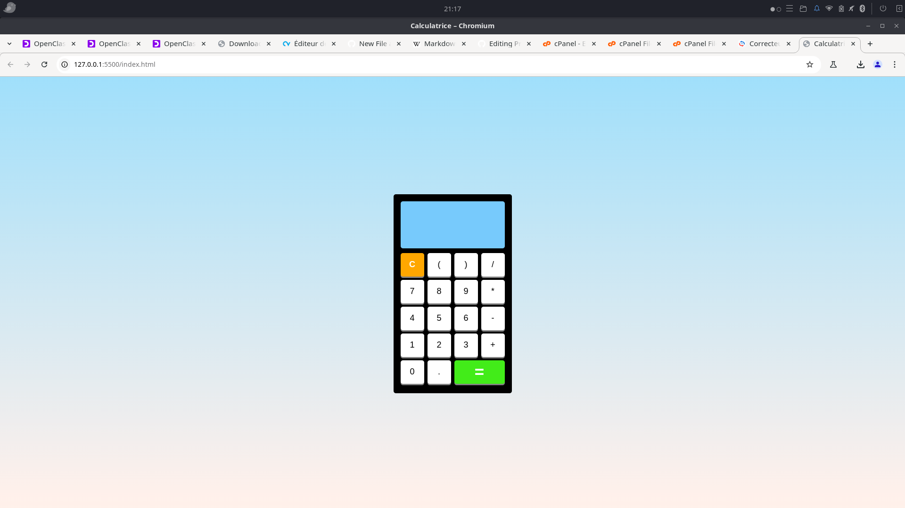

# Projet Calculatrice Version 1.0

Projet personnel : Calculatrice
Dans le cadre de mon apprentissage et par pur plaisir de coder, j’ai réalisé une petite calculatrice web. L’objectif était simple : créer un outil pratique tout en continuant à m’exercer sur le HTML, CSS et JavaScript.
 
 
Cette calculatrice permet d’effectuer les opérations de base (addition, soustraction, multiplication, division), avec une interface simple agréable à utiliser.
 
 
 Objectifs du projet : 
 
  -M’entraîner à manipuler le DOM avec JavaScript,

  -Gérer les événements et les interactions utilisateur,

  -Renforcer mes bases en logique de programmation.

 

Envie d'essayer?
https://alx-370.github.io/Projet-Perso-CalculatriceV1/   

Ouvrir en premier le fichier index.html

## 🛠️Compérences :

## 🔗Liens :

